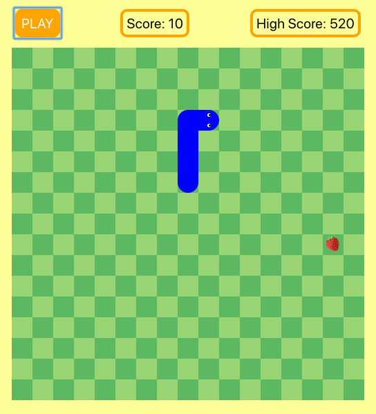

## Play the game

Currently available [here](https://ssssnek.herokuapp.com)

## Run locally

1. In the command line, run `git clone git@github.com:KateHoward10/snek.git`
2. Navigate into `/snek`
3. Run `yarn` or `npm install` to install node_modules
4. Run `yarn start` or `npm start`
